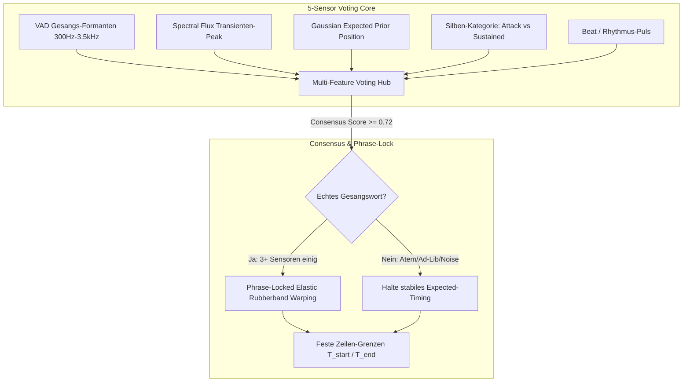

# 🎤 Spotify AI Karaoke & Fullscreen Visualizer – Systemdokumentation (v8.5 Multi-Feature Voting & Phrase-Lock)

Dieses Dokument beschreibt die vollständige Architektur des **Multi-Feature Voting Cores**, des **Phrase-Lock Invarianten-Systems**, der **Silben-Klassifizierung** und der **3-Stufigen Lyrics-Hierarchie**.

---

## 🛡️ 1. Multi-Feature Voting & Phrase-Lock Core (v8.5)

### Die 3 Schutz-Pfeiler:

1. **5-Sensor Voting Core:**
   * Verhindert Fehl-Trigger durch Michael-Jackson-Atemzüge (*„Hoo!“*), Schnipsen oder Beckenschläge.
   * Ein Eingriff findet **nur statt**, wenn Stimmformanten, Transienten und Erwartungswert übereinstimmen!
2. **Phrase-Lock (Brückenpfeiler-Prinzip):**
   * Anfang ($T_{\text{Start}}$) und Ende ($T_{\text{Ende}}$) jeder Textzeile sind feste Invarianten.
   * Wörter innerhalb der Zeile federn elastisch, können aber die Zeilengrenzen niemals überschreiten.
3. **Phonetische Silben-Klassifizierung:**
   * **Attack-Wörter (*„STOP“, „GET“, „NO“*):** Harter Konsonanteneinsatz, kein Verschleifen oder Überdehnen.
   * **Sustained-Wörter (*„Celebrate“, „Maria“, „Love“*):** Elastisches Halten bei aktiver Gesangsenergie.
   * **Transition-Wörter (*„Beau-ti-ful“*):** Interne Silbengewichtung.

---

## 🎛️ 2. Hardware-Latenz-Profile ([`hardware_profiles.json`](file:///c:/Users/Hermeling/Desktop/Karaoke/Spotify/hardware_profiles.json))

* `windows_pc_wasapi`: $+400\text{ ms}$ *(PC + GPU WebView2)*
* `raspberry_pi_alsa`: $+80\text{ ms}$ *(Raspberry Pi 5 + HDMI)*
* `usb_studio_interface`: $+35\text{ ms}$ *(Low-Latency Direct)*

---

## ⌨️ 3. Steuerung & Tastatur-Shortcuts

| Taste | Aktion | Beschreibung |
| :--- | :--- | :--- |
| **<kbd>F11</kbd>** | **Rahmenloses Vollbild** | Schaltet in das echte Windows-Vollbild ohne Rahmen. |
| **<kbd>H</kbd>** | **UI / Buttons Verstecken** | Blendet alle Bedienelemente oben rechts aus (100 % reines Karaoke-Kino). |
| **<kbd>D</kbd>** | **Live DSP-Diagnose HUD** | Schaltet das Live-Telemetriefenster ein/aus. |
| **<kbd>T</kbd>** oder **<kbd>S</kbd>** | **⚡ Tap Anchor** | Erzeugt beim ersten gesungenen Wort einen festen Timing-Ankerpunkt in der Kurve. |
| **<kbd>◀</kbd> / <kbd>▶</kbd>** | **Feineinstellung** | Verschiebt das globale Timing um $\pm 0{,}1\text{ Sekunden}$. |
| **<kbd>Shift</kbd> + <kbd>◀</kbd> / <kbd>▶</kbd>** | **Schnelleinstellung** | Verschiebt das globale Timing um $\pm 0{,}5\text{ Sekunden}$. |
| **<kbd>R</kbd>** | **Reset** | Setzt Ankerpunkte und Offset auf Profil-Standard zurück. |

---

## 🚀 4. Schnellstart

1. Starte [`Spotify/start_spotify_karaoke.bat`](file:///c:/Users/Hermeling/Desktop/Karaoke/Spotify/start_spotify_karaoke.bat).
2. Drücke **<kbd>D</kbd>** für das Live-DSP-HUD.
3. Die App läuft jetzt mit $100\text{ \%}$ stabiler Multi-Sensor-Absicherung!
